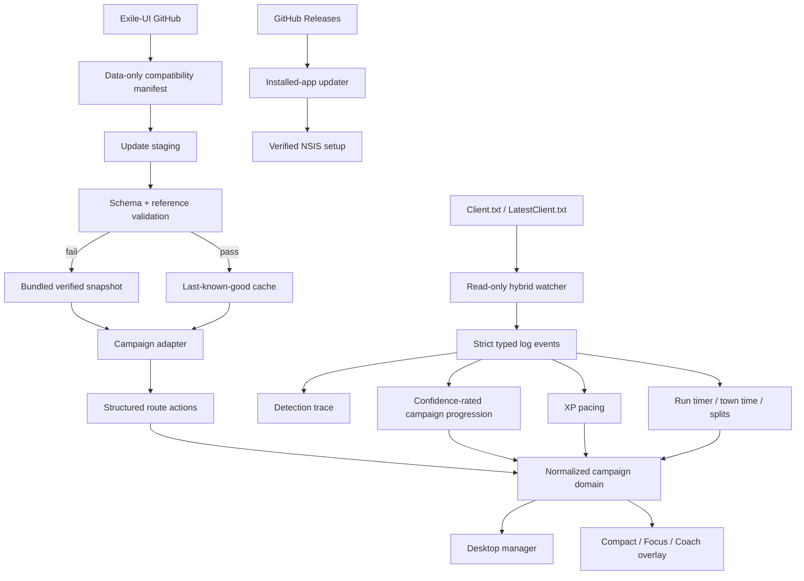

# Architecture

## Runtime topology



The UI never parses Exile-UI's AHK-flavoured data directly. `src/core/campaign.ts` remains the normalization boundary, and `src/core/actions.ts` converts source route lines into semantic player-facing actions.

## Data identity and route presentation

Each imported step receives a deterministic semantic ID built from act, area context, action slug and content hash. Annotations are matched by selectors (`act`, optional `areaId`, required content tokens), not raw array position. CI audits every selector so upstream wording changes cannot silently erase coaching indefinitely.

Structured actions are independent of presentation. Decisive actions such as kill, travel, waypoint, reward, passive, trial and relog outrank directional/context clues. The Focus overlay renders the hierarchy:

1. `NOW`
2. `DON'T MISS`
3. `NEXT`
4. small high-value layout/XP/run context

Presentation (`compact`, `focus`, `coach`) is independent from guidance depth (`beginner`, `balanced`, `racer`).

## Campaign progression and observability

Automatic progress decisions record a confidence level:

- `verified`: internal area ID matched a bounded route transition;
- `inferred`: display-name fallback or logically implied state;
- `manual`: explicit user correction/resume.

Progress changes persist reason/confidence history and can be undone. The live matcher remains bounded around current progress to prevent repeated Act 1/Act 6 locations from causing giant jumps. Startup reconciliation inspects only a bounded log tail and offers large disagreements to the user rather than silently applying them.

Every parsed event also enters a bounded detection trace containing:

- event type and area identity;
- route step before/after;
- confidence where applicable;
- the progression reason;
- original raw log line.

Diagnostics can therefore explain exactly why an automatic route decision did or did not happen.

## Log tracking

`electron/services/log-watcher.ts` owns the log lifecycle. It starts at EOF for live data, scans only a bounded startup tail, buffers partial writes, reads bounded chunks, combines `fs.watch` with polling, handles truncation/recreation, retries after temporary disappearance, and discovers Steam libraries through `libraryfolders.vdf`.

Strict parsing separates internal generated-area, displayed entered-area and character-level events. An area-level line such as `Generating level N area ...` can never masquerade as a character-level event.

## Run timing

`src/core/run.ts` is pure/testable run-state logic. The Electron process persists `run.json` and records:

- start/pause/finish state;
- elapsed time excluding explicit pauses;
- Act splits when route progress enters a later act;
- time spent in known town internal-area IDs;
- previous completed run;
- personal best from bounded local history.

The UI ticks the displayed clock locally every second; Electron does not broadcast the entire campaign dataset once per second. Zone duplicates are ignored for town-time accounting.

## Permanent rewards

Passive-point and Ascendancy-trial steps are separate from ordinary optional objectives. ExileQuesting distinguishes:

- `pending`;
- `route-passed` (the route cursor moved beyond it);
- `confirmed` (the user explicitly confirms completion/claim).

Route progression alone is never presented as proof that a permanent reward was obtained. `/passives` remains the authoritative final passive-quest audit before mapping.

## XP and layout intelligence

`src/core/xp.ts` classifies pacing using PoE's level-dependent safe-zone formula rather than a fixed level-difference rule. The overlay exposes actionable states only.

`assets/campaign/layouts.json` is independent from upstream campaign routing. Each hint carries internal area ID, concise guidance, confidence, source label, version applicability and enabled/stale support. Static diagrams can later be versioned independently.

## Campaign upstream activation

1. Load the bundled schema-validated compatibility definition.
2. Fetch the Exile-UI commit SHA after application startup.
3. Fetch only guide/area files for the immutable commit and validated path mapping.
4. Validate raw structure and references in memory.
5. Atomically stage the accepted files and manifest.
6. Build the normalized dataset/actions.
7. Broadcast the accepted state.

Any failure keeps the existing verified in-memory/bundled dataset active. Remote compatibility metadata is constrained data only and cannot contain executable application code.

## Installed application updates

`electron/services/app-updater.ts` intentionally updates the installed NSIS application, not individual app files.

1. Query the stable GitHub Releases endpoint.
2. Require a non-draft, non-prerelease semantic version newer than the running application.
3. Require the exact `ExileQuesting-<version>-setup.exe` asset.
4. Download to a `.partial` file under Electron `userData/updates`.
5. Verify the byte size and GitHub-provided SHA-256 asset digest when available.
6. Atomically rename the completed installer.
7. Only after explicit user action, schedule the NSIS installer after ExileQuesting exits.

No GitHub credential is embedded in the app. Consequently, normal clients cannot consume a private GitHub release feed. A public repository or dedicated public release repository is a deployment requirement before distributing self-update to external users.

`.github/workflows/release.yml` is tag driven. It requires the Git tag to match `package.json`, reruns validation, builds the NSIS installer, smoke-tests an actual installation, creates a SHA-256 checksum and publishes the GitHub Release. Portable distribution is intentionally not maintained.

## Crash and failure recovery

`electron/services/session-guard.ts` writes a small `session-active.json` marker after successful startup. Normal shutdown removes it. Its presence on the next launch means the previous session ended abnormally, allowing the UI to surface recovery guidance without mutating saved route progress.

Electron renderer/child-process exits and unresponsive/responsive events are logged. Diagnostics can be copied or exported as a text report.

## Electron security

- Node integration disabled in renderers.
- Context isolation enabled.
- Renderer sandbox enabled.
- Only a narrow explicit preload API is exposed.
- New renderer windows are denied; normal HTTP(S) links open externally.
- Renderer cannot request arbitrary filesystem operations.
- No remote HTML or executable code is loaded into application windows.
- App update downloads are installers from a constrained release asset, not remote JavaScript/configurable commands.

## Persistence

Mutable state lives under Electron `userData`:

- `settings.json`;
- `progress.json` plus bounded progression history;
- `run.json` plus bounded completed-run history;
- `reward-audit.json` explicit confirmations;
- `session-active.json` abnormal-shutdown marker;
- `campaign/current/*`;
- `updates/*` downloaded setup files;
- `logs/main.log`.

JSON writes use a temporary sibling file followed by rename. The installer does not delete user data during normal update/uninstall flows.

## Current module boundaries

```text
src/core
  campaign        route normalization and validation
  actions         semantic route actions
  progression     transitions, history and startup reconciliation
  log-parser      strict log-event parsing
  layouts         confidence-rated layout helpers
  rewards         explicit permanent-reward audit
  run             timer, splits, town time and run history
  updates         release/version validation
  xp              experience pacing
  compatibility   remote data validation and semantic diff foundations

electron/services
  log-watcher     Client.txt lifecycle, polling and discovery
  overlay-window  bounds, placement and dynamic sizing
  app-updater     release check/download/install scheduling
  session-guard   abnormal-shutdown marker

src/ui
  App             manager/overlay composition
  reliability     updater/run/audit/recovery/trace surfaces
  styles          base visual system
  reliability.css reliability feature styling
```

PoB, Gear Coach and Crafting Coach should continue to enter through pure typed core modules rather than expanding Electron/main-process logic directly.
