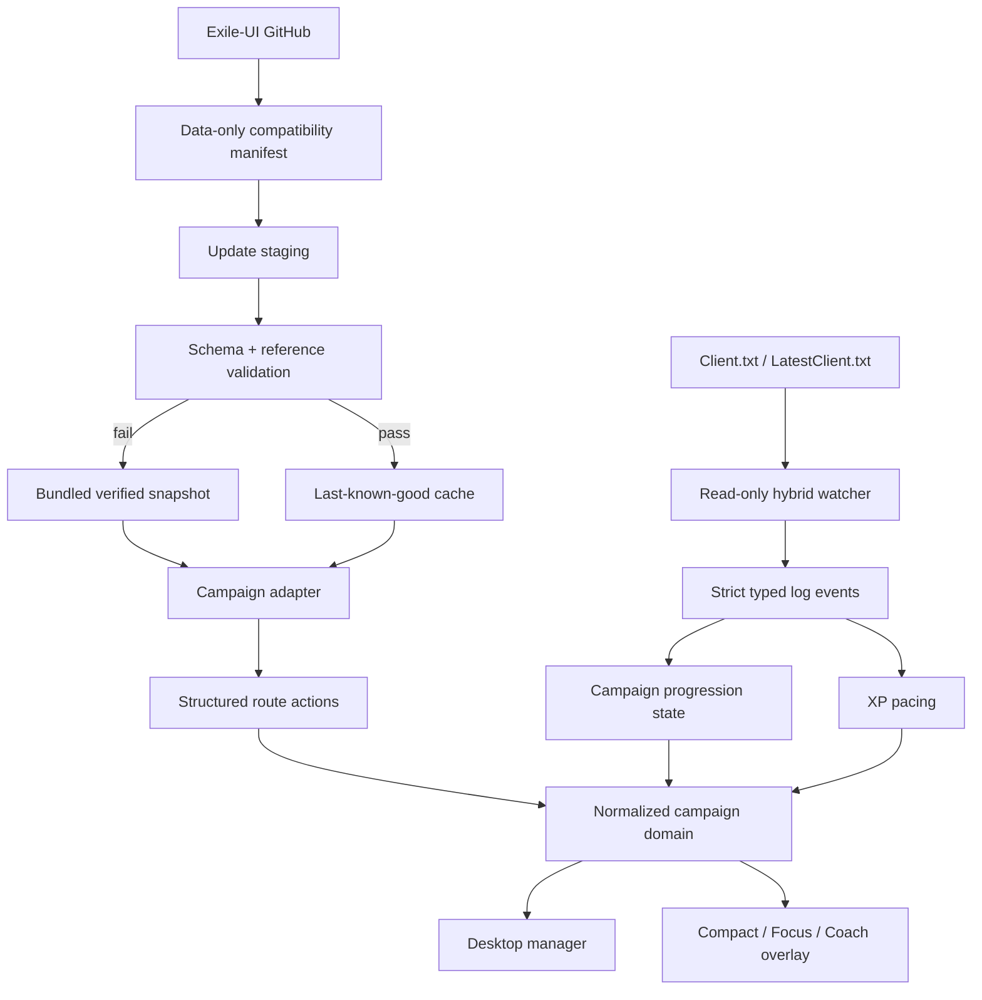

# Architecture

## Runtime topology



The UI never parses Exile-UI's AHK-flavoured data directly. `src/core/campaign.ts` remains the normalization boundary, and `src/core/actions.ts` converts source route lines into semantic player-facing actions.

## Data identity

Each imported step receives an ID built from:

- game and act;
- the last referenced internal area ID;
- a human-readable action slug;
- a deterministic content hash.

Annotations are matched by semantic selectors (`act`, optional `areaId`, and required content tokens), not raw array position. A newly inserted upstream step therefore does not shift every annotation.

Structured actions are derived independently of presentation. The default overlay renders decisive actions such as kill, travel, waypoint, reward, passive, trial and relog. Directional clues remain contextual so a wall-following hint cannot outrank the actual objective.

## Overlay information architecture

Overlay presentation and guidance depth are separate settings:

- Presentation: `compact`, `focus`, `coach`.
- Guidance: `beginner`, `balanced`, `racer`.

Focus is the default gameplay HUD. Its hierarchy is deliberately:

1. `NOW`
2. `DON'T MISS`
3. `NEXT`
4. small high-value layout/XP context

Coach progressively discloses longer explanations. Typography fields are stored separately from overall window/UI scaling so readability can increase without making every control disproportionately large.

The renderer reports its content height to the main process. Electron owns physical window bounds, display clamping, position presets, edge snapping and recovery from off-screen monitor changes.

## Campaign progression

Automatic progress decisions record a confidence level:

- `verified`: internal area ID matched a bounded route transition;
- `inferred`: display-name fallback or logically implied state;
- `manual`: explicit user correction/resume.

Automatic transitions never need game memory or inventory inspection. They infer only what a reachable later zone safely proves. Progress changes are persisted with reason/confidence history and can be undone.

The normal live matcher remains bounded around current progress to prevent repeated Act 1/Act 6 locations from causing giant jumps. Startup reconciliation is different: a bounded tail of the current log is inspected, global candidate matches are compared with saved progress, and large disagreements are offered to the user rather than silently applied.

## Log tracking

`electron/services/log-watcher.ts` owns the log lifecycle.

The watcher:

- starts at EOF for new live events;
- inspects only a bounded startup tail for current-zone reconciliation;
- buffers partial filesystem writes;
- reads growth in bounded chunks;
- uses `fs.watch` plus a lightweight file-size polling safety net;
- handles truncation/recreation;
- attempts to reattach after temporary file failures;
- exposes detailed health information to Diagnostics;
- discovers Steam libraries from `libraryfolders.vdf` before falling back to common install paths.

Strict parsing distinguishes:

- internal generated-area events;
- displayed entered-area events;
- the specific character-level event form.

An area-level line such as `Generating level N area ...` can therefore never masquerade as a character-level event.

## XP and permanent rewards

`src/core/xp.ts` classifies pacing using PoE's level-dependent safe-zone formula rather than a fixed `-3` rule. The overlay exposes only actionable states: behind, efficient or overlevelled.

Passive-point and Ascendancy-trial route steps are tracked separately from ordinary optional objectives. Completion is reported only when route progress safely supports it; `/passives` remains the authoritative late-campaign audit.

## Layout intelligence

`assets/campaign/layouts.json` is independent from upstream campaign routing. Each hint carries:

- internal area ID;
- concise independently written guidance;
- confidence;
- source/reference label;
- game-version applicability;
- enabled/stale state support.

Focus mode normally surfaces high/medium confidence only. Static diagrams can later be versioned independently so stale images can be disabled without changing campaign routing.

## Upstream activation transaction

1. Load the bundled, schema-validated compatibility definition.
2. Fetch upstream commit SHA.
3. If unchanged, record a healthy check.
4. Fetch only guide and area files for that immutable SHA/path mapping.
5. Validate both in memory.
6. Atomically write guide, areas, and manifest into `campaign/current`.
7. Build the normalized dataset and structured actions.
8. Broadcast the accepted state to both windows.

Any exception before activation leaves the current in-memory dataset intact. On next launch, malformed cached files are rejected and the bundled snapshot loads.

Remote compatibility metadata is data-only and validated against constrained repository/path/schema rules. It cannot contain or execute application code. Parsing a new upstream campaign successfully is not sufficient approval for advancing the bundled fallback: CI also generates route/annotation review data.

## Electron security

- Node integration disabled in renderers.
- Context isolation enabled.
- Renderer sandbox enabled.
- Only a narrow, explicit preload API is exposed.
- New windows are denied; HTTP(S) links open in the system browser.
- Renderer cannot choose arbitrary filesystem operations.
- No remote HTML or executable code is loaded into application windows.

## Persistence

Mutable state is stored under Electron `userData`:

- `settings.json` including overlay typography/position/accessibility;
- `progress.json` including bounded progression history;
- `campaign/current/*`;
- `logs/main.log` through electron-log.

Writes use a temporary sibling file followed by rename. The installer does not delete user data during uninstall by default, allowing reinstall/upgrade recovery.

## Current module boundaries

```text
src/core
  campaign        route normalization and validation
  actions         semantic NOW/NEXT-capable route actions
  progression     confidence-rated transitions, history, startup reconciliation
  log-parser      pure strict log-event parsing
  layouts         confidence-rated layout-data helpers
  rewards         passive/trial route progress
  xp              experience pacing model
  compatibility   remote data validation and semantic diff foundations
  pob             future decoding and build-stage model
  gems            future acquisition/link planner
  crafting        future independent goal/planning engine

electron
  main            lifecycle and composition root
  services/
    log-watcher   Client.txt lifecycle, polling and discovery
    overlay-window bounds, display placement and dynamic sizing
  preload         narrow renderer bridge

src/ui
  App             current manager/overlay composition
  styles          shared visual system and Overlay V2 states
```

The main process and `App.tsx` still contain composition/UI breadth and should be split further before PoB and crafting significantly expand the feature surface. Core gameplay decisions are already kept in pure typed modules so that refactor does not require rewriting route logic.
