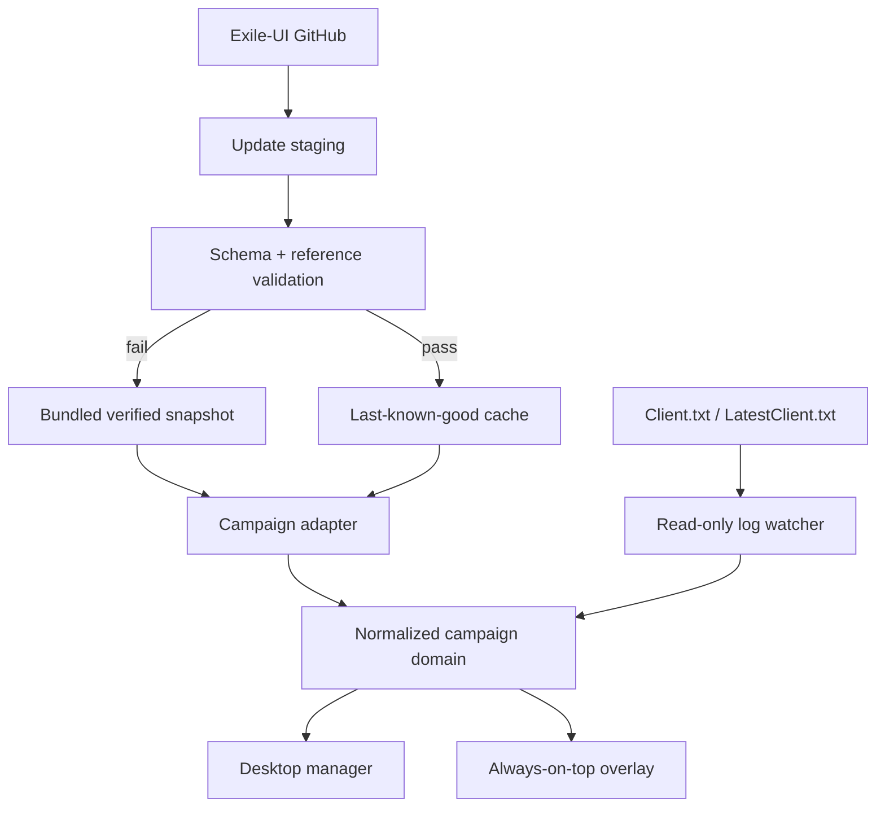

# Architecture

## Runtime topology



The UI never parses Exile-UI's AHK-flavoured data directly. `src/core/campaign.ts` is the boundary.

## Data identity

Each imported step receives an ID built from:

- game and act;
- the last referenced internal area ID;
- a human-readable action slug;
- a deterministic content hash.

Annotations are matched by semantic selectors (`act`, optional `areaId`, and required content tokens), not raw array position. A newly inserted upstream step therefore does not shift every annotation.

This is stronger than index matching but not perfect: a rewritten objective can require annotation review. The updater reports unmatched/invalid structures rather than silently guessing.

## Upstream activation transaction

1. Fetch upstream commit SHA.
2. If unchanged, record a healthy check.
3. Fetch only the guide and area files for that immutable SHA.
4. Validate both in memory.
5. Atomically write guide, areas, and manifest into `campaign/current`.
6. Build the normalized dataset.
7. Broadcast the new state to both windows.

Any exception before step 6 leaves the current in-memory dataset intact. On next launch, malformed cached files are rejected and the bundled snapshot loads.

## Log tracking

The watcher begins at the end of the existing file so old sessions cannot fast-forward a new run. New lines are buffered across partial filesystem events. Two signals are understood:

- internal area generation: stable and preferred;
- English entered-area text: useful fallback and current-zone display.

When an area matches a nearby future route page, progress moves to the instruction after that transition. Search is deliberately bounded around the current progress to avoid an Act 1 town event jumping to a later same-name/reference occurrence.

## Electron security

- Node integration disabled in renderers.
- Context isolation enabled.
- Renderer sandbox enabled.
- Only a narrow, explicit preload API is exposed.
- New windows are denied; HTTP(S) links open in the system browser.
- Renderer cannot choose arbitrary filesystem operations.
- No remote HTML is loaded into application windows.

## Persistence

Mutable state is stored under Electron `userData`:

- `settings.json`;
- `progress.json`;
- `campaign/current/*`;
- `logs/main.log` through electron-log.

Writes use a temporary sibling file followed by rename. The installer does not delete user data during uninstall by default, allowing reinstall/upgrade recovery.

## Module boundaries for planned work

```text
src/core
  campaign        route normalization, validation, matching
  log-parser      pure log-event parsing
  pob             future decoding and build-stage model
  gems            future acquisition/link planner
  crafting        future independent goal/planning engine

electron
  main            lifecycle and composition root
  services        future watcher/updater/settings modules
  preload         narrow renderer bridge

src/ui
  manager         dashboard and configuration
  overlay         in-game route presentation
```

The current main process remains in one file for the first milestone but its services are kept as pure or narrow functions. It should be split before PoB and crafting arrive.

